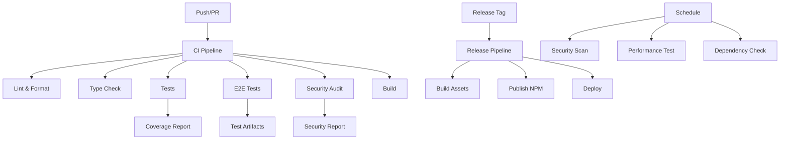

# GitHub Workflows & Best Practices

This directory contains GitHub Actions workflows and configuration files that implement comprehensive CI/CD, security, and quality assurance practices for the PipeLens project.

## Workflows Overview

### 🔄 CI/CD Pipeline (`ci.yml`)
**Triggers:** Push to main/develop/feature branches, PRs, manual dispatch

**Jobs:**
- **Lint & Format** - Code quality checks with ESLint and Biome
- **Type Check** - TypeScript type checking across all packages
- **Test** - Unit and integration tests with Vitest
- **E2E Tests** - End-to-end tests with Playwright
- **Security Audit** - Dependency vulnerability scanning
- **Build** - Application build verification
- **Dependencies** - Outdated dependency checking
- **Coverage** - Code coverage analysis and reporting

### 🚀 Deployment (`deploy.yml`)
**Triggers:** Push to main/develop, manual dispatch

**Jobs:**
- **Deploy to Staging** - Automatic deployment to staging environment
- **Deploy to Production** - Production deployment with approval gates
- **Notify Deployment** - Deployment status notifications

### 🔒 Security (`security.yml`)
**Triggers:** Push to main/develop, daily schedule, manual dispatch

**Jobs:**
- **Dependency Scan** - Vulnerability scanning with pnpm audit
- **Code Scan** - Static security analysis with ESLint security plugin
- **Container Scan** - Docker image vulnerability scanning with Trivy
- **Secret Scan** - Secret detection with TruffleHog and GitLeaks
- **License Check** - License compliance verification
- **SAST Analysis** - Static Application Security Testing with CodeQL
- **Security Headers** - HTTP security headers validation

### 📊 Performance (`performance.yml`)
**Triggers:** Push to main/develop, weekly schedule, manual dispatch

**Jobs:**
- **Lighthouse Audit** - Web performance auditing
- **Bundle Size Analysis** - Bundle size monitoring and limits
- **Load Testing** - API load testing with Artillery
- **Memory Analysis** - Memory usage monitoring
- **Performance Regression** - Performance regression detection

### 🎯 Code Quality (`quality.yml`)
**Triggers:** Push to main/develop/feature branches, PRs, manual dispatch

**Jobs:**
- **Bundle Size Analysis** - Bundle size monitoring
- **Performance Testing** - Performance test execution
- **Accessibility Testing** - Accessibility compliance testing
- **Code Complexity** - Code complexity analysis
- **Dead Code Detection** - Unused code detection

### 🔄 Dependencies (`dependencies.yml`)
**Triggers:** Weekly schedule, manual dispatch

**Jobs:**
- **Check Outdated** - Dependency update checking
- **Security Updates** - Security vulnerability monitoring
- **Update Dependencies** - Automated dependency updates (optional)

### 📦 Dependabot (`dependabot.yml`)
**Triggers:** Weekly schedule, manual dispatch

**Jobs:**
- **Update Dependencies** - Automated dependency updates
- **Security Updates** - Security vulnerability monitoring
- **Update Lockfile** - pnpm lockfile updates

### 🏷️ Release (`release.yml`)
**Triggers:** Git tags, manual dispatch

**Jobs:**
- **Create Release** - Automated release creation
- **Build Assets** - Multi-platform asset building
- **Publish to NPM** - NPM package publishing
- **Notify Release** - Release notifications

### 🔀 PR Management (`pr-management.yml`)
**Triggers:** PR events, issue events

**Jobs:**
- **PR Validation** - Pull request validation
- **Auto Assign** - Automatic reviewer assignment
- **Label PR** - Automatic PR labeling
- **Breaking Changes** - Breaking change detection
- **Issue Management** - Issue auto-labeling
- **Welcome Contributor** - First-time contributor welcome

## Configuration Files

### 📋 Issue Templates
- **Bug Report** - Standardized bug reporting
- **Feature Request** - Feature request template
- **Question** - General question template

### 🔀 Pull Request Template
- Comprehensive PR checklist
- Change type classification
- Testing requirements
- Breaking change documentation

### 👥 CODEOWNERS
- Code ownership definition
- Review requirements
- File-specific ownership

### 🔒 Security Policy
- Vulnerability reporting process
- Supported versions
- Security best practices
- Incident response procedures

## Best Practices Implemented

### 🛡️ Security
- **Dependency Scanning** - Regular vulnerability checks
- **Secret Detection** - Prevents accidental secret commits
- **SAST Analysis** - Static code security analysis
- **License Compliance** - Ensures legal compliance
- **Security Headers** - HTTP security validation

### 🚀 Performance
- **Bundle Size Monitoring** - Prevents bundle bloat
- **Lighthouse Audits** - Web performance validation
- **Load Testing** - API performance testing
- **Memory Analysis** - Resource usage monitoring
- **Regression Detection** - Performance regression prevention

### 🧪 Testing
- **Unit Tests** - Component and function testing
- **Integration Tests** - API and service testing
- **E2E Tests** - Full user flow testing
- **Coverage Reporting** - Code coverage tracking
- **Test Artifacts** - Test result preservation

### 📊 Quality
- **Code Linting** - Consistent code style
- **Type Checking** - Type safety validation
- **Complexity Analysis** - Code complexity monitoring
- **Dead Code Detection** - Unused code identification
- **Accessibility Testing** - WCAG compliance

### 🔄 Automation
- **Dependency Updates** - Automated dependency management
- **Release Management** - Automated versioning and publishing
- **PR Management** - Automated PR processing
- **Issue Management** - Automated issue triage
- **Deployment** - Automated deployment pipeline

## Workflow Dependencies

## Monitoring & Alerts

### 📈 Metrics Tracked
- **Build Success Rate** - CI pipeline reliability
- **Test Coverage** - Code coverage percentage
- **Security Vulnerabilities** - Dependency security status
- **Performance Scores** - Lighthouse performance metrics
- **Bundle Size** - Application bundle size trends

### 🚨 Alerts Configured
- **Build Failures** - Immediate notification on CI failures
- **Security Vulnerabilities** - High/critical vulnerability alerts
- **Performance Regression** - Significant performance degradation
- **Dependency Updates** - Available dependency updates
- **Release Status** - Deployment success/failure notifications

## Getting Started

### 🔧 Local Development
1. Install dependencies: `pnpm install`
2. Start development servers: `pnpm run dev`
3. Run tests: `pnpm run test`
4. Run E2E tests: `pnpm run test:e2e`

### 🚀 CI/CD Usage
1. **Automatic** - Workflows run automatically on push/PR
2. **Manual** - Use "Actions" tab to trigger workflows manually
3. **Scheduled** - Security and performance scans run automatically
4. **Conditional** - Some workflows only run on specific branches

### 📊 Monitoring
1. **Actions Tab** - View workflow execution status
2. **Security Tab** - Monitor security alerts and vulnerabilities
3. **Insights Tab** - View project metrics and trends
4. **Releases Tab** - Track releases and deployments

## Customization

### ⚙️ Workflow Configuration
- Modify trigger conditions in workflow files
- Adjust job dependencies and requirements
- Customize notification settings
- Configure environment-specific settings

### 🔧 Tool Configuration
- Update ESLint rules in `biome.json`
- Modify Playwright settings in `playwright.config.ts`
- Adjust Vitest configuration in `vitest.config.ts`
- Customize Lighthouse thresholds in `.lighthouserc.json`

### 📋 Template Customization
- Update issue templates for project-specific needs
- Modify PR template checklist
- Customize CODEOWNERS file
- Update security policy contact information

## Troubleshooting

### 🐛 Common Issues
- **Workflow Failures** - Check logs in Actions tab
- **Test Failures** - Run tests locally to debug
- **Security Alerts** - Review and address vulnerabilities
- **Performance Issues** - Analyze Lighthouse reports

### 🔍 Debugging
- Enable debug logging in workflows
- Use workflow artifacts for investigation
- Check environment variables and secrets
- Review workflow permissions and access

## Contributing

### 📝 Adding New Workflows
1. Create new workflow file in `.github/workflows/`
2. Follow existing naming conventions
3. Include proper documentation
4. Test workflow locally when possible
5. Update this README with new workflow details

### 🔧 Modifying Existing Workflows
1. Test changes in a feature branch
2. Update documentation accordingly
3. Consider backward compatibility
4. Notify team of significant changes

## Resources

### 📚 Documentation
- [GitHub Actions Documentation](https://docs.github.com/en/actions)
- [Playwright Testing](https://playwright.dev/)
- [Vitest Testing](https://vitest.dev/)
- [Lighthouse CI](https://github.com/treosh/lighthouse-ci-action)

### 🛠️ Tools
- [ESLint](https://eslint.org/)
- [Biome](https://biomejs.dev/)
- [CodeQL](https://codeql.github.com/)
- [Trivy](https://trivy.dev/)
- [Artillery](https://artillery.io/)

---

**Note:** This configuration provides a comprehensive CI/CD pipeline with security, performance, and quality assurance. Adjust settings based on your project's specific needs and requirements.
